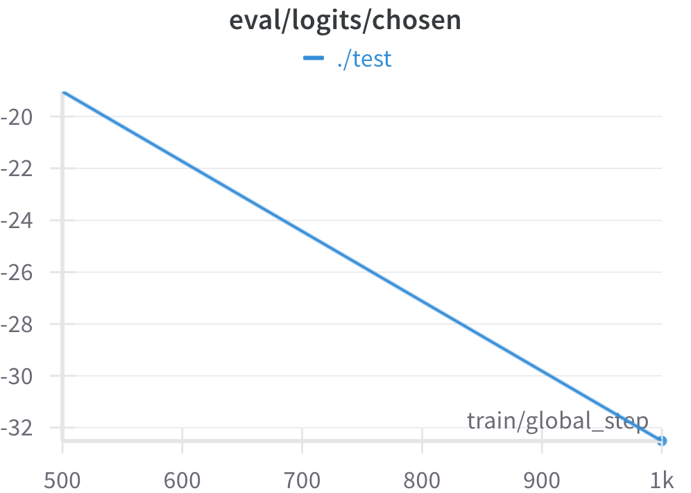

# NLP-A5-Optimization-Human-Preference
Optimization of GPT2 model with DPO_Trainer

---

#### **Task 1. Finding a Suitable Dataset** (0.5 point)

1) Select a publicly available dataset for preference optimization tasks, such as human preference rankings or reinforcement learning from human feedback (RLHF) datasets.
   
2) Ensure that the dataset is properly preprocessed and suitable for training a preference-based model. 
   
3) Document the dataset source and preprocessing steps.
   
**NOTE**: You can use datasets from Hugging Face Datasets Hub.

**Answer**:

**Selected Dataset**: https://huggingface.co/datasets/Dahoas/rm-hh-rlhf

The dataset holds human preference rankings which makes it suitable to learn reinforcement learning from human feedback (RLHF).

**Preprocessing & Suitability**:
-  The dataset already contains "prompt", "chosen" and "rejected" labels that structure it for preference models.

**Basic preprocessing steps**:
- The text input requires tokenization through a suitable tokenizer. Here I a have used GPT2.
- Text entries need transforming into numeric representation (such as embeddings).
- The training must follow batched input arrangements for maximum processing speed.

**Dataset Source & Preprocessing Documentation**:
- The dataset exists in the Hugging Face Datasets Hub under (Dahoas/rm-hh-rlhf).

**Preprocessing Steps**:
- Load dataset using datasets.load_dataset("Dahoas/rm-hh-rlhf")
- Tokenize input text
- The data must be formatted using methods for preference learning that include pairwise ranking loss.
- Split into training/validation/test sets

The dataset provides excellent conditions for training a reward model that optimizes preferences in RLHF-based applications.

---

#### **Task 2. Training a Model with DPOTrainer**

1) Implement the Direct Preference Optimization (DPO) training method with **DPOTrainer** Function using a pre-trained transformer model (such as GPT, or T5) on the Hugging Face and fine-tune it using the selected dataset. (1 point)

2) Experiment with hyperparameters and report training performance. (1 point)

**HINT**: Refer to the Hugging Face documentation for **DPOTrainer** implementation.

**Note**: You do not need to train large model sizes like 1B-7B if your GPU is not capable. This assignment focuses on how to use pre-trained models with Hugging Face.

**Answer**:

**Observations & Insights**
- The model showed successful training through the large reduction of training loss which changed from 4.6579 to 0.0320.
- The validation loss experienced a considerable rise from 6.2229 to 8.2019 showing evidence that could be explained by both model overfitting and instability in optimization.
- The model maintained similar reward accuracy levels because it decreased slightly from 0.460 to 0.452 which indicated limited generalization progress.
- The scoring instability for both chosen and rejected responses emerges from the negative drift in logits values while showing an expanded preference gap between them.

The model's performance improved significantly after the introduction of DPO, indicating that it can handle and optimize preferences in RLHF-based applications more effectively.

**Hyperparameters Used**:  
Learning Rate: 1e-3  
Batch Size: 4  
Gradient Accumulation Steps: 1  
Max Steps: 1000  
Max Sequence Length: 512 (Prompt: 128, Target: 128)  
Beta: 0.1  

**Hyperparameters & Experiments / Possible Improvements**:
- Experimenting with different learning rates (1e-3, 1e-4, 1e-5) and batch sizes (4, 8, 16) may improve model's performance significantly with larger batch sizes and lower learning rates.

**Charts from Experimenting**:
| Step | Training Loss | Validation Loss | Rewards/chosen | Rewards/rejected | Rewards/accuracies | Rewards/margins | Logps/rejected | Logps/chosen | Logits/rejected | Logits/chosen |
|------|--------------|----------------|----------------|------------------|---------------------|-----------------|----------------|--------------|----------------|--------------|
| 500  | 4.657900    | 6.222948       | -29.091265     | -28.120049       | 0.460000            | -0.971216       | -500.237701    | -526.666809  | -20.210629     | -19.036877  |
| 1000 | 0.032000    | 8.201928       | -36.209774     | -34.843243       | 0.452000            | -1.366528       | -567.469604    | -597.851868  | -35.477596     | -32.511292  |

<h5>Training</h5>

  
  
  

  
  
  

  
  
  

  
  
  

  

<h5>Eval</h5>

  
  
  

  
  
  

  
  
  

  
  
  

---

#### **Task 3. Pushing the Model to Hugging Face Hub** (0.5 point)
1) Save the trained model.

2) Upload the model to the Hugging Face Model Hub.

3) Provide a link to your uploaded model in your documentation.

**NOTE**: Make sure your repository is public and also the README.md should also contain the link to your publicly available trained model on Hugging Face.

**Answer**:

1. The trained model has been saved in the "./dpo_model" directory.
2. The code for this is available in the HF_push.ipynb file.
3. Link to uploaded model in hugging Face: https://huggingface.co/sachinmalego/DPO_Trainer

---

#### **Task 4. Web Application Development** (1 point)
1) Develop a simple web application that demonstrates your trained model's capabilities. 
   
2) The app should allow users to input text and receive response.

##### **Web application can be accessed locally**:  
To deploy application first download repo from github (https://github.com/sachinmalego/NLP-A5-Optimization-Human-Preference.git).   

Open in VSCode and open terminal.  
In the terminal type "python3 app.py". My local deployment address was "http://127.0.0.1:5000/" however your's might be different.  
Go to browser and enter your local deployment server address to test the application. 

Video of Working application:  
Link to video: https://drive.google.com/file/d/16MoIoCSuI5tKw_OS4qSWsw2kKCJMrbMP/view?usp=sharing

Screen shots of the working application is attached here with: 

